# M365 Weekly Report Automation with n8n

> **Production-style Microsoft 365 tenant reporting workflow built with n8n and Microsoft Graph API.**

This project automates the collection, analysis, reporting, archiving, and distribution of a weekly Microsoft 365 tenant report.

The workflow connects to Microsoft Graph using app-only OAuth 2.0 authentication, collects tenant organisation, licensing, and user information, calculates operational KPIs, generates a professionally formatted Excel workbook plus CSV exports, archives the files to SharePoint, and sends a formatted HTML email with the workbook attached.

## Project Highlights

- Scheduled weekly execution
- Microsoft Graph API integration
- App-only OAuth 2.0 authentication
- Microsoft 365 licence utilisation analysis
- Full user-directory collection with pagination
- Active, blocked, guest, and unlicensed account analysis
- E-mail-domain segmentation
- Licence health classification: **Healthy / Watch / Critical**
- Blocked-account licence reclamation analysis
- Week-over-week KPI comparison using n8n workflow static data
- Automated Excel workbook generation
- Automated CSV exports
- SharePoint archival
- HTML executive-summary email
- Email delivery through Microsoft Graph `sendMail`
- Retry handling on Microsoft Graph HTTP requests
- Soft-fail handling for organisation lookup
- Configurable thresholds and domain rules
- Safe email-send gate for testing

## What Problem Does It Solve?

Microsoft 365 administration often requires repeatedly collecting information from several tenant-level sources and turning that information into a management-friendly report.

This workflow turns that manual process into a repeatable automation:

```text
Microsoft Graph
      |
      v
Tenant + Licence + User Data
      |
      v
Normalisation & Analysis
      |
      +----------------------+
      |                      |
      v                      v
Excel Workbook           CSV Exports
      |                      |
      +----------+-----------+
                 |
                 v
          SharePoint Archive
                 |
                 v
        Executive Email Report
```

Instead of manually checking Microsoft 365 licensing and account information every week, the workflow creates the reporting package automatically.

## Workflow Architecture

```mermaid
flowchart LR
    A[Weekly Schedule] --> B[Configuration]
    B --> C[Get Organisation]
    C --> D[Handle Organisation Result]
    D --> E[Get Subscribed SKUs]
    E --> F[Filter & Map Licences]
    F --> G[Get Users - Paginated]
    G --> H[Flatten Users]
    H --> I[Normalise Users]
    I --> J[Domain Segmentation]
    J --> K[Compute KPIs]
    K --> L[Blocked & Unlicensed Analysis]
    L --> M[Reporting Period]
    M --> N[Previous Week Comparison]
    N --> O[Assemble Dataset]
    O --> P[Build Excel Workbook]
    P --> Q[Build CSV Files]
    Q --> R[Upload Workbook]
    R --> S[Upload User CSV]
    S --> T[Upload Licence CSV]
    T --> U[Upload Blocked CSV]
    U --> V[Capture SharePoint Links]
    V --> W[Build Email Payload]
    W --> X[Email Send Gate]
    X --> Y[Microsoft Graph SendMail]
```



## 25-Node Workflow

| # | Node | Purpose |
|---:|---|---|
| 1 | Schedule Trigger | Starts the workflow weekly |
| 2 | Config | Central configuration and reporting rules |
| 3 | Get Organisation | Retrieves Microsoft 365 organisation information |
| 4 | Handle Organisation Result | Handles organisation lookup success/failure |
| 5 | Get Subscribed SKUs | Retrieves tenant licence subscriptions |
| 6 | Filter and Map Licences | Filters unwanted SKUs, maps friendly names, calculates utilisation |
| 7 | Get Users (All Pages) | Retrieves users through Microsoft Graph pagination |
| 8 | Flatten Paginated Users | Combines all returned user pages |
| 9 | Normalise Users | Creates a consistent reporting model for each account |
| 10 | Compute Domain Segmentation | Groups users by e-mail domain |
| 11 | Compute KPIs | Calculates tenant-level headline metrics |
| 12 | Blocked and Unlicensed Accounts | Identifies blocked/unlicensed accounts and reclamation candidates |
| 13 | Reporting Period Logic | Calculates the actual week-ending date |
| 14 | Previous-Week Comparison | Compares the current snapshot with the previous stored snapshot |
| 15 | Assemble Consolidated Report Dataset | Creates the final internal reporting dataset |
| 16 | Build Excel Workbook | Generates the formatted multi-sheet `.xlsx` report |
| 17 | Build CSV Files | Generates user, licence, and blocked-account CSV exports |
| 18 | Upload Workbook to SharePoint | Archives the Excel report |
| 19 | Upload User Directory CSV to SharePoint | Archives the full user export |
| 20 | Upload Licence Utilisation CSV to SharePoint | Archives the licensing export |
| 21 | Upload Blocked Accounts CSV to SharePoint | Archives the blocked-account export |
| 22 | Capture SharePoint Links | Captures the returned archive URLs |
| 23 | Build Email Body and Payload | Builds the HTML executive summary and Graph mail payload |
| 24 | Gate Email Send | Allows safe testing without sending mail |
| 25 | Send Mail | Sends the report through Microsoft Graph |

## Reporting Output

### 1. Excel Workbook

The generated workbook contains:

- **Cover Sheet**
- **Executive Summary**
- **Licence Utilisation**
- Dedicated worksheets for configured/qualifying e-mail domains
- **Other Domains**, when applicable
- **Blocked Accounts**
- **Full User Directory**

The workbook includes formatting, frozen headers, status highlighting, calculated totals, reporting metadata, and internal-use classification.

### 2. CSV Exports

Three CSV files are produced:

```text
UserDirectory_<date>.csv
LicenceUtilisation_<date>.csv
BlockedAccounts_<date>.csv
```

These are useful for downstream analysis, audit, archival, or further automation.

### 3. Email Report

The workflow builds a professional HTML email containing:

- Total accounts
- Active accounts
- Blocked accounts
- Overall licence utilisation
- Licence utilisation table
- Account distribution by domain
- Workbook attachment
- SharePoint archive reference

The workbook is attached to the email, while the generated files are also archived in SharePoint.

## Licence Utilisation Logic

The workflow filters configured non-reporting SKUs and calculates:

```text
Available Seats = Total Seats - Assigned Seats

Utilisation = Assigned Seats / Total Seats

Healthy  = Utilisation < 70%
Watch    = 70% to < 90%
Critical = 90% or higher
```

The thresholds are configurable in the `Config` node.

For critical licences, the workflow recommends:

> Procure additional seats or reclaim unused licences

For watch-level licences:

> Monitor consumption; plan procurement

## User Analysis

Each Microsoft 365 account is normalised into reporting fields including:

- Display name
- E-mail address
- Domain
- Department
- Job title
- Office
- Account status
- Account type
- Assigned licences
- Licence count
- Account creation date
- Account age

The workflow also identifies:

- Active accounts
- Blocked accounts
- Guest accounts
- Unlicensed accounts
- Blocked accounts that still consume licences

The last category is particularly useful for licence-reclamation reviews.

## Domain Segmentation

Accounts are grouped by their e-mail domain.

A domain receives its own worksheet when it is:

1. Explicitly mapped in `domainDisplayNames`, or
2. Large enough to meet `minUsersForOwnTab`.

Configured `alwaysIncludeDomains` are also retained as dedicated reporting domains.

Microsoft `.onmicrosoft.com` domains can be excluded from dedicated worksheets through:

```text
excludeOnMicrosoftDomain
```

## Week-over-Week Comparison

The workflow stores one previous KPI snapshot using n8n workflow static data.

When a previous snapshot exists for an earlier reporting period, the workflow calculates deltas for selected metrics such as:

- Total users
- Active users
- Blocked users
- Unlicensed users
- Assigned licences
- Overall licence utilisation

The first run will not have a previous snapshot, so week-over-week comparison is unavailable until a subsequent run.

## Error Handling

The workflow includes several reliability controls.

### Organisation lookup

The organisation lookup is deliberately soft-failed. If it does not return usable organisation information, the configured organisation name is retained and an explicit `organisationLookupFailed` flag is carried through the report.

### Microsoft Graph retries

The Graph HTTP nodes are configured with retries and a delay between attempts.

### User pagination

User collection follows Microsoft Graph's `@odata.nextLink` pagination mechanism and combines all returned pages before processing.

The workflow also limits pagination requests to protect against runaway execution.

### Email safety gate

The `Config` node contains:

```text
skipEmailSend
```

When enabled, the `Gate Email Send` node returns no items and the final mail node does not execute.

This is useful when importing and testing the workflow.

## Technology Stack

- **n8n** — workflow orchestration
- **Microsoft Graph API** — Microsoft 365 tenant data
- **OAuth 2.0 Client Credentials** — app-only authentication
- **Microsoft Entra ID** — application identity
- **SharePoint / OneDrive for Business** — report archival
- **ExcelJS** — programmatic Excel workbook generation
- **JavaScript** — n8n Code node processing

## Prerequisites

Before running the workflow, you need:

1. A working n8n instance.
2. A Microsoft Entra ID application registration.
3. App-only OAuth 2.0 credentials configured in n8n.
4. Microsoft Graph application permissions appropriate for:
   - Organisation/tenant information
   - Directory/user information
   - Licence information
   - SharePoint file upload
   - Mail sending
5. Admin consent for the selected Microsoft Graph permissions.
6. A SharePoint site and destination folder.
7. The `exceljs` package available to the n8n Code node runtime.
8. Permission for the n8n Code node to load external modules, where required by your deployment.

> **Important:** Use the least-privilege Microsoft Graph permissions possible for your environment and validate the exact permission set against Microsoft's current Graph documentation and your tenant security policy.

## Configuration

Open the **Config** node and update the following values:

```javascript
organisationName
reportOwner
senderMailbox
recipientEmails
ccEmails
sharePointSiteId
sharePointFolderPath
skipEmailSend
domainDisplayNames
alwaysIncludeDomains
minUsersForOwnTab
excludeOnMicrosoftDomain
highUsagePct
mediumUsagePct
weekEndingDayOfWeek
excludedSkus
skuFriendlyNames
```

### Example

```javascript
organisationName: 'Your Organisation',
reportOwner: 'IT Infrastructure Team',

senderMailbox: 'reports@example.com',
recipientEmails: ['recipient@example.com'],
ccEmails: [],

sharePointSiteId: 'YOUR_SHAREPOINT_SITE_ID',
sharePointFolderPath: '/Reports/M365WeeklyReport',

skipEmailSend: true
```

The repository version intentionally uses example values. Replace them with your own tenant configuration before execution.

## Microsoft Graph Credential

The workflow expects an n8n OAuth2 credential conceptually named:

```text
Microsoft Graph - App Only (Client Credentials)
```

The exported workflow contains placeholder credential references and does **not** contain a client secret.

Create/configure the credential in n8n rather than committing authentication material to Git.

## Security Considerations

This workflow handles potentially sensitive tenant information, including:

- User names
- E-mail addresses
- Department information
- Job titles
- Account status
- Licence assignments

Therefore:

- Do not commit production report outputs to a public repository.
- Do not commit client secrets, access tokens, certificates, or private keys.
- Do not commit production tenant IDs or internal SharePoint identifiers unless the repository is appropriately restricted.
- Use GitHub repository secrets for CI/CD-related secrets.
- Prefer private repositories when project documentation contains organisation-specific information.
- Review the workflow before sharing it externally.

The GitHub-ready workflow included in this package has been sanitised with example organisation/domain/e-mail values.

## Repository Structure

```text
M365-Weekly-Report-n8n/
├── README.md
├── .gitignore
├── LICENSE
├── docs/
│   ├── ARCHITECTURE.md
│   └── CONFIGURATION.md
└── workflow/
    └── M365-Weekly-Report.json
```

## Importing the Workflow into n8n

1. Download or clone this repository.
2. Open n8n.
3. Import `workflow/M365-Weekly-Report.json`.
4. Create/configure the Microsoft Graph OAuth2 app-only credential.
5. Update the `Config` node.
6. Set `skipEmailSend` to `true` during initial testing.
7. Execute the workflow manually.
8. Validate Graph responses and SharePoint uploads.
9. Verify the generated workbook and CSV files.
10. Set `skipEmailSend` to `false` only after successful validation.
11. Activate the workflow.

## Recommended Testing Sequence

### Phase 1 — Data collection

Confirm that:

- Organisation information is returned.
- Subscribed SKUs are returned.
- All user pages are collected.
- User count is reasonable.

### Phase 2 — Data processing

Validate:

- Licence utilisation percentages.
- Active/blocked account counts.
- Unlicensed account counts.
- Domain segmentation.
- Blocked accounts holding licences.

### Phase 3 — File generation

Open the generated workbook and confirm:

- Cover Sheet
- Executive Summary
- Licence Utilisation
- Domain worksheets
- Blocked Accounts
- Full User Directory

Also validate the three CSV exports.

### Phase 4 — SharePoint

Confirm all four generated files appear in the configured SharePoint folder.

### Phase 5 — Email

Only after all previous phases succeed:

```text
skipEmailSend = false
```

Then test the final Graph `sendMail` operation.

## Design Decisions

### Why Microsoft Graph?

Microsoft Graph provides a unified API surface for Microsoft 365 tenant information, directory users, licences, SharePoint resources, and mail operations.

### Why app-only authentication?

The workflow is intended for unattended weekly execution. App-only authentication avoids dependence on an interactive user session.

### Why generate the Excel file inside n8n?

Keeping report generation inside the workflow removes the need for a separate reporting server or scheduled script.

### Why archive CSV files as well?

CSV exports make the reporting pipeline easier to integrate with downstream analytics, audits, data processing, or other automation systems.

### Why keep the email gate?

A workflow that can be imported and tested without accidentally sending mail is safer for development and deployment.

## Current Scope and Limitations

This project is intentionally focused on tenant-level weekly reporting.

Known characteristics include:

- Week-over-week history is based on one previous static-data snapshot.
- Historical trend storage is not a full time-series database.
- The workflow depends on the n8n runtime being able to load `exceljs`.
- Microsoft Graph permissions and tenant policies vary by environment.
- The public-safe repository version uses placeholders and must be configured before production use.
- Production report files should not be committed to Git.

## Future Improvements

Potential extensions include:

- Persistent historical storage in PostgreSQL
- Power BI dashboard integration
- Multi-week trend charts
- Licence-expiry forecasting
- Automated licence reclamation workflows
- Teams notifications
- Alerting when licence utilisation crosses critical thresholds
- Failed-run notification workflow
- Central configuration using environment variables
- Separate development/staging/production configurations
- Automated unit tests for transformation logic
- More granular Microsoft Graph permission review

## Project Status

**Status:** Production-oriented workflow template

**Automation:** End-to-end workflow from Microsoft Graph collection to SharePoint archive and email distribution.

**Security:** Repository version sanitised for public GitHub sharing; production credentials and tenant-specific values must be configured separately.

## Author

Maintained as an n8n automation project for Microsoft 365 administration, reporting, and operational automation.

## License

This repository is provided under the MIT License. See `LICENSE` for details.
