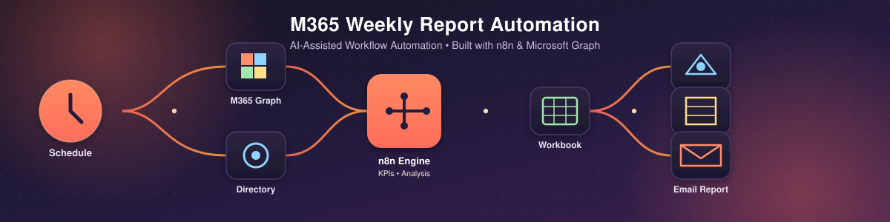

<p align="center">
  
</p>

<h1 align="center">M365 Weekly Report Automation</h1>

<p align="center">
  An AI-assisted, production-style <strong>n8n</strong> workflow that turns weekly Microsoft 365 tenant reporting into a fully automated pipeline — powered by the Microsoft Graph API.
</p>

<p align="center">
  
  
  
  
  
</p>

---

## What is this?

This repository packages a complete **n8n automation** that connects to a Microsoft 365 tenant, collects organisation, licensing, and user-directory data via the **Microsoft Graph API**, calculates operational KPIs, and produces a polished reporting package — automatically, every week, with no manual effort.

It's a real-world example of **AI-era workflow automation**: instead of an administrator manually pulling reports from the Microsoft 365 admin center each week, a scheduled n8n workflow does the collection, analysis, formatting, archiving, and distribution end-to-end.

```text
Microsoft Graph  →  Normalise & Analyse  →  Excel + CSV  →  SharePoint Archive  →  Executive Email
```

## Highlights

- ⏰ **Scheduled, unattended execution** — runs weekly with app-only OAuth 2.0 authentication
- 📊 **Licence utilisation analysis** with Healthy / Watch / Critical classification
- 👥 **Full user-directory collection** with pagination, domain segmentation, and account-status analysis
- 📈 **Week-over-week KPI comparison** using n8n workflow static data
- 📁 **Automated Excel workbook + CSV exports**, archived straight to SharePoint
- 📧 **HTML executive-summary email**, sent via Microsoft Graph `sendMail`
- 🛡️ **Safe-by-default**: a configurable email-send gate and sanitised, public-safe example values

## Repository layout

```text
.
├── assets/
│   └── banner.svg                     # Repo banner (this file)
└── M365-Weekly-Report-n8n-GitHub/
    ├── README.md                      # Full project documentation
    ├── LICENSE
    ├── project.json
    ├── docs/
    │   ├── ARCHITECTURE.md            # Data flow & data model
    │   └── CONFIGURATION.md           # Configuration reference
    └── workflow/
        └── M365-Weekly-Report.json    # The importable n8n workflow
```

## Getting started

1. Open [`M365-Weekly-Report-n8n-GitHub/README.md`](M365-Weekly-Report-n8n-GitHub/README.md) for full setup, configuration, and testing instructions.
2. Import [`workflow/M365-Weekly-Report.json`](M365-Weekly-Report-n8n-GitHub/workflow/M365-Weekly-Report.json) into your n8n instance.
3. Configure the Microsoft Graph app-only OAuth 2.0 credential and the workflow's `Config` node.
4. Keep `skipEmailSend: true` while testing, then disable it once validated.

See [`docs/ARCHITECTURE.md`](M365-Weekly-Report-n8n-GitHub/docs/ARCHITECTURE.md) for the data flow and [`docs/CONFIGURATION.md`](M365-Weekly-Report-n8n-GitHub/docs/CONFIGURATION.md) for the full configuration reference.

## Technology stack

**n8n** &middot; **Microsoft Graph API** &middot; **OAuth 2.0 (client credentials)** &middot; **Microsoft Entra ID** &middot; **SharePoint / OneDrive for Business** &middot; **ExcelJS**

## License

This repository is provided under the [MIT License](M365-Weekly-Report-n8n-GitHub/LICENSE).
